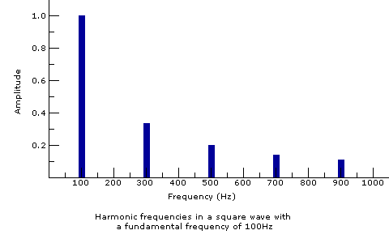
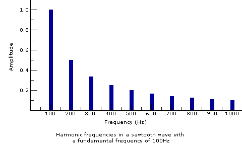
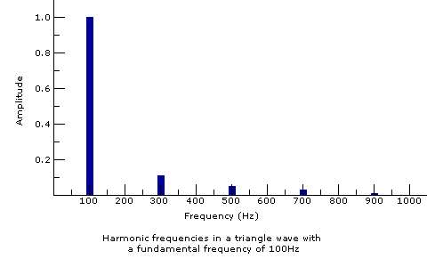
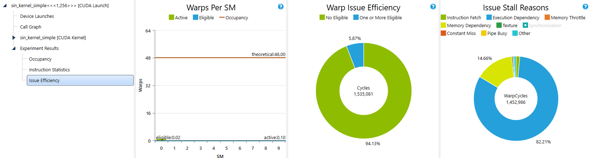
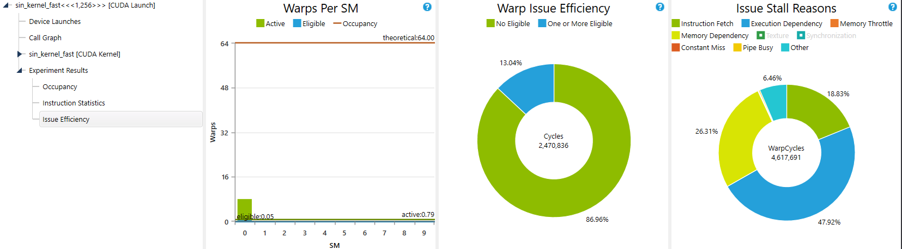
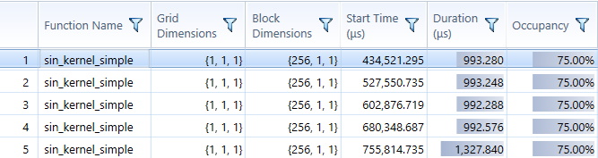
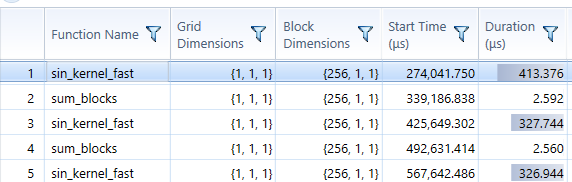

CUDA Additive Synthesis
======================

**University of Pennsylvania, CIS 565: GPU Programming and Architecture, Project 2**

* Davis Polito
* Tested on: Windows 10, i7-8750H @ 2.2GHz 16GB, GTX 1060

# Intro to Additive Synthesis
Additive synthesis is based off the concept that any wave form can be represented via a Fourier transform as a sum of individual sinewave and amplitudes. This can be seen in the simple graphs of harmonic content for square, saw, and triangle wave forms. 



One of the bottle necks of this form of synthesis is a CPUs ability to compute sine waves in real time without latency. In *Savioja, Lauri & Välimäki, Vesa & Smith, Julius. (2010).* Real-time additive synthesis with one million sinusoids using a GPU. 128th Audio Engineering Society Convention 2010. 1. a method for computing additive synthesis on a gpu using parallel threads is espoused. In my project I was able to successfully implement the simple and complex kernel. This kernel can compute over 20,000 sine waves at 32 samples per kernel. 


## Additive Synthesis on the GPU vs. CPU

Additive Synthesis on a CPU is very straightforward. Computation occurs in a nested for loop where the inner loop computes the sum of all the sinewaves at time *t*(represented as angle in radians). This can be naively parallelized by expanding that outer for loop into threads on a gpu kernel. This is done in the simple implementation with relative success. 


As you can see there is little utilization of the gpu and most of the time is spent waiting for process execution with no warps that can execute. This is because looping in a gpu kernel is never suggested. We would prefer to compute each individual sine wave at time *t* in seperate kernels as well as spread the computation of those samples across various blocks. We then sum those blocks individually. 


This may be a more complicated explanation than the average person can understand so I present to you the execution speed data to better explain improvements. 

The simple kernel has an average execution time of ~1 millisecond

Whereas the fast kernel has an average execution time of less than half a millisecond. 


### Planned Improvements

- [ ] Real time addition of sinewaves
    *   Dynamic Memory heap based memory allocation
    *   Cons: 
        * Must Add a host to Device Copy for every kernel invocation which will increase latency (i.e. must compute more samples per kernel invocation)
- [ ] Bandpassed Modulation of SineWaves
    *   Memory Coalescing to group frequency bands together
- [ ] Port Code to Jetson Nano
    *  Interaction will come via physical control
- [ ] Optimization 
- [ ] Interesting Ramping functions (tanh, logarithmic, custom)

### How to Run Program and other useful controls to know
Currently there are two different versions of the code that can be run. The simple kernel will compute NUM_SINE sine waves based on the filling algorithm used at line 160. This doesn't sound very good unless you specify a good number of sinewaves like 20 and the algorithm spaces out the sinewaves well enough. You can select the algorithm by uncommenting #define SIMPLE at the top of the code

The other algorithm can be selected by commenting out the #define SIMPLE line. This algorithm attempts to reproduce the THX Deep Note sound utilizing a fill scheme developed from a CCRMA homework assignment by jmccarty. 

SAMPLES_PER_THREAD and THREADS_PER_SAMPLE define important function of the compex kernel. SAMPLES_PER_THREAD defines how many steps of the function each THREAD is filling. THREADS_PER_SAMPLE defines the number of sinusoids that are used to compute each SAMPLE in the thread. The division of labor here is important and defines the speed of kernel execution. Optimal relationship has yet to be determined.

These Program execution schemes will be changed as the code is developed. 


## Real Time Audio Output and learning more about CMake than I ever really cared to

In order to start this project I needed to find a way to output audio in real time. Rather than working directly with the drivers and wasting time in that domain I thought it would be easier to simply use an audio SDK I could find online. I settled on the STK from Stanford's Center for Computer Research in Music and Acoustics (CCRMA). What I didn't know is how much of a headache it would be to get this compiled using CMake and then integrating it with a cuda executable environment. For the sanity of those who come after me I have listed the exact steps needed to setup this environment.
1. Download the RtAudio SDK (https://github.com/thestk/rtaudio)
    * Run ```mkdir build; cd build```
    * Run ```cmake --build . --target install --config Release```
    * Now you have installed the library into your Program Files directory. You can include them in CMake files by using 'include_sub_directory(User/Program Files/RtAudio/include/)' and the library file by using add_library(User/Program Files/include/lib/rtaudio.lib)
    * Building will cause an error complaining about missing rtaudio.dll. You now must take rtaudio.dll from the RtAudio/bin directory and put it in your build/Release directory. 
    * Now you can finally run your program
2. You probably want to add a CUDA kernel to your program now.. ha ha goodluck
3. You'll quickly realize that no matter what you do everything you just did on Windows is in x86, but CUDA build in x64. Here is when you take to the issues tab of the audio SDK (https://github.com/thestk/rtaudio/issues/221)
4. Here you will learn that you need not waste 15+ hours trying to work with building and installing and learning and questioning where CMakes gets off on being so damn confusing. 
5. Here you will learn that if you simply include RtAudio.cpp, RtAudio.h and use WASAPI everything works. EVERYTHINGWORKS!!!!
6. Sacrifice 1000 CPUs to the Jensen Huang.
7. Begin Coding


